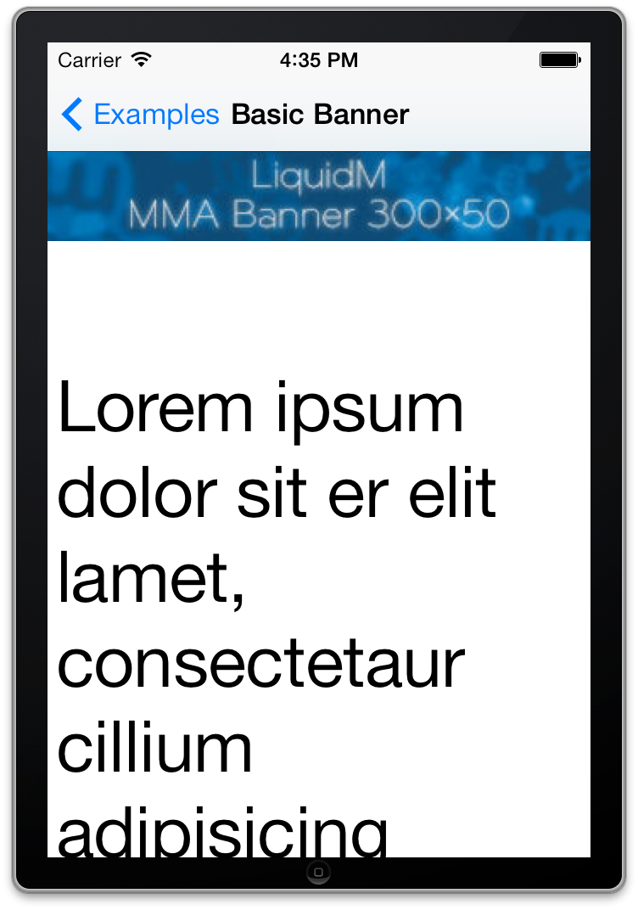
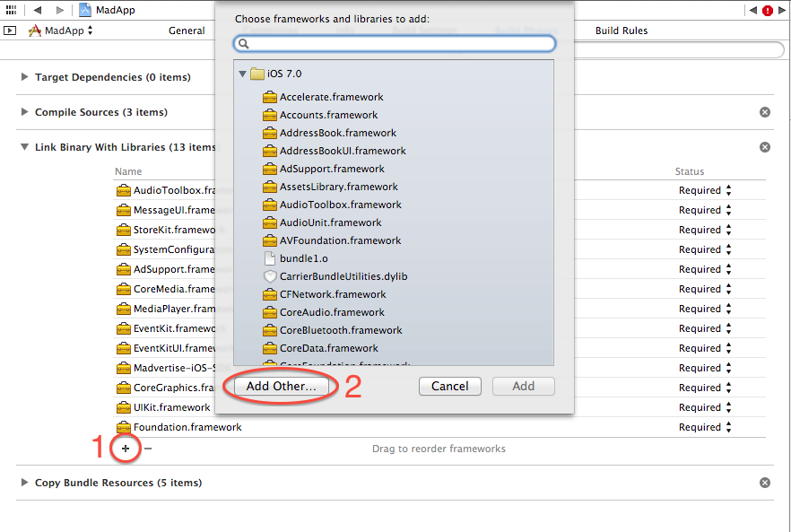
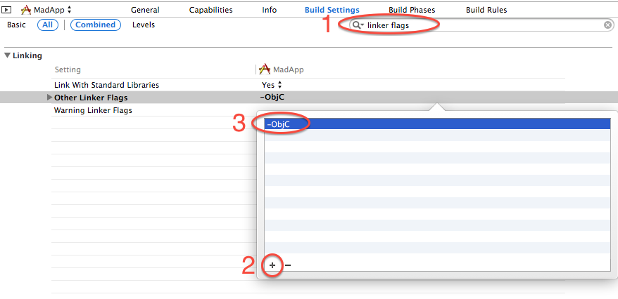
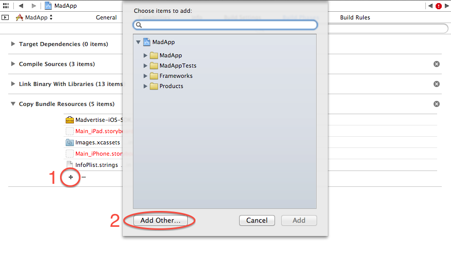

LiquidM iOS SDK v1.4.4
======================

The LiquidM iOS SDK allows you to request and present ads in your app. It includes the newest mobile ad technology and provides the following features:

* Request & integrate banners and interative creatives based on standard adslot sizes (mma, medium rectangle etc.)
* Request & integrate banners and interative creatives based on custom adslot sizes
* HD banner support
* Supports [MRAID 2.0](http://www.iab.net/media/file/IAB_MRAID_v2_FINAL.pdf) (interactice rich media creatives)
* Interstitials based on images
* Pre- and post-roll Video ads (based on [VAST](http://www.iab.net/media/file/VASTv3.0.pdf))
* Supports Video ads skip button
* Video player landscape-portrait auto adaptation
* Supported video formats: webm, mp4, ogg
* DFP mediation (External adapter for [DFPNetwork Mediation](https://developers.google.com/mobile-ads-sdk/docs/dfp/mediation))
* The majority of the LiquidM iOS SDK classes make use of ARC

Repository structure
--------------------

This repository contains an example app (LiquidMExampleApp) and provides all the files to integrate the LiquidM iOS SDK in your app. We suggest that you clone this repository with git (git clone https://github.com/liquidm/ios-sdk-sample.git). If you're not familiar with git you can download the content of this repository as zip archive ([download](https://github.com/liquidm/ios-sdk-sample/archive/master.zip)).

After you cloned this repository or unzipped the archive you'll find the following structure:

* [adapter](https://github.com/liquidm/ios-sdk-sample/tree/master/adapter): This folder contains the adapter to integrate the LiquidM iOS SDK into the [DFP Network Mediation](https://developers.google.com/mobile-ads-sdk/docs/dfp/mediation)
* [docs](https://github.com/liquidm/ios-sdk-sample/tree/master/docs): Contains a documentation of the public SDK interface
* [example](https://github.com/liquidm/ios-sdk-sample/tree/master/example): Contains an example app which contains the LiquidM iOS SDK
* [framework](https://github.com/liquidm/ios-sdk-sample/tree/master/framework): This folder contains the actual SDK
* [CHANGELOG.md](https://github.com/liquidm/ios-sdk-sample/blob/master/CHANGELOG.md): Documentation of SDK changes
* [README.md](https://github.com/liquidm/ios-sdk-sample/blob/master/README.md): this documentation

Try the example app
-------------------

First of all you should try to open our example app which contains already the LiquidM iOS SDK. To do so you just have to open the project file "LiquidMExample.xcworkspace" in the [example folder](https://github.com/liquidm/ios-sdk-sample/tree/master/example) with XCode. This example app should work out of the box and you can try to start the app by pressing the play button. This starts the example app in the simulator and you can request e.g. a basic banner:

If you see the banner which is shown above you can start to integrate the SDK in your app. If you've issues with the example app please make sure that your XCode is uptodate. We created this documentation with XCode 5.0.2.

Integrate the SDK in your app
-----------------------------

The folder [framework](https://github.com/liquidm/ios-sdk-sample/tree/master/framework) contains a framework file "LiquidM-iOS-SDK.framework" which contains the LiquidM iOS SDK. To integrate the SDK in your app you need to copy our framework into your project folder and link your app project against our framework:

Futhermore our SDK depends on some other frameworks. Please add the following frameworks to your project as well:

* AudioToolbox.framework
* MessageUI.framework
* StoreKit.framework
* SystemConfiguration.framework
* AdSupport.framework
* CoreMedia.framework
* MediaPlayer.framework
* EventKit.framework
* EventKitUI.framework
* AVFoundation.framework
* libxml2.dylib

Add the following flags to "Other Linker Flags" in "Build Settings":
<pre>-ObjC</pre>
Confirm that flags are set for both 'DEBUG' and 'RELEASE'.

Add the bundle inside the framework. This can be found on LiquidMiOSSDK.framework/Versions/A/Resources

You integrated the LiquidM iOS SDK successfully. The next section decribes different Use Cases and how you integrate them in your app.

Use Cases
=========

This section contains some common uses and describes howto integrate different kind of ads in your app. Please make sure, that you replace the "TestTokn" with your personal token. The "TestTokn" contains example ads and allows you to test your implementation.

Request ad by standard adslot sizes
-----------------------------------
<pre>
#import "ViewController.h"
#import &lt;LiquidM-iOS-SDK/LiquidM.h&gt;

@interface ViewController () &lt;LiquidMVideoViewControllerDelegate&gt; {
    LiquidMVideoViewController *lmAd;
}

@end

@implementation ViewController

- (void)viewDidLoad
{
    [super viewDidLoad];
    NSMutableDictionary *options = [NSMutableDictionary dictionary];
    [options setObject:@"TestTokn" forKey:LiquidMControllerOptionToken];

    lmAd = [LiquidMAdViewController controllerWithRootViewController:self
                                    adClass:LiquidMAdClassMMA
                                    options:options];

    lmAd.delegate = self;
    [self.view addSubview:lmAd.view];
}

- (void)controllerDidReceiveAd:(LiquidMAdViewController *)controller
{
    [self.view bringSubviewToFront:lmAd.view];
    [lmAd presentAd];
}

- (void)controller:(LiquidMAdViewController *)controller didFailToReceiveAdWithError:(NSError *)error
{
    NSLog(@"Failed to receive an ad.\nError: %@", error);
}

@end
</pre>

Besides LiquidMAdClassMMA (320x53, 300x50, 6:1) the LiquidM iOS SDK provides the following standard adslot sizes:

* LiquidMAdClassMediumRectangle (300x250, 6:5)
* LiquidMAdClassLeaderboard (728x90)
* LiquidMAdClassFullscreen (768x768)
* LiquidMAdClassPortrait (766x66)
* LiquidMAdClassLandscape (1024x66)

Request ad by custom adslot sizes
---------------------------------
<pre>
#import "ViewController.h"
#import &lt;LiquidM-iOS-SDK/LiquidM.h&gt;

@interface ViewController () &lt;LiquidMVideoViewControllerDelegate&gt; {
    LiquidMVideoViewController *lmAd;
}

@end

@implementation ViewController

- (void)viewDidLoad
{
    [super viewDidLoad];
    NSMutableDictionary *options = [NSMutableDictionary dictionary];
    [options setObject:@"TestTokn" forKey:LiquidMControllerOptionToken];

    lmAd = [LiquidMAdViewController controllerWithRootViewController:self
                                    adSize:CGSizeMake(320,53)
                                    options:options];

    lmAd.delegate = self;
    [self.view addSubview:lmAd.view];
}

- (void)controllerDidReceiveAd:(LiquidMAdViewController *)controller
{
    [self.view bringSubviewToFront:lmAd.view];
    [lmAd presentAd];
}

- (void)controller:(LiquidMAdViewController *)controller didFailToReceiveAdWithError:(NSError *)error
{
    NSLog(@"Failed to receive an ad.\nError: %@", error);
}

@end
</pre>

You can replace the size which is passed to the LiquidMAdViewController as "adSize" by passing a arbitrary size. Please keep in mind that requesting ads with uncommon adslot sizes will cause a very low fillrate.

Request Interstitial ads
------------------------
<pre>
#import "ViewController.h"
#import &lt;LiquidM-iOS-SDK/LiquidM.h&gt;

@interface ViewController () &lt;LiquidMVideoViewControllerDelegate&gt; {
    LiquidMVideoViewController *lmAd;
}

@end

@implementation ViewController

- (void)viewDidLoad
{
    [super viewDidLoad];
    NSMutableDictionary *options = [NSMutableDictionary dictionary];
    [options setObject:@"TestTokn" forKey:LiquidMControllerOptionToken];
    [options setObject:[NSNumber numberWithBool:NO] forKey:LiquidMControllerOptionReload];

    lmAd = [LiquidMAdViewController controllerWithRootViewController:self
                                                             adClass:LiquidMAdClassRichMedia
                                                             options:options];

    lmAd.delegate = self;
}

- (void)controller:(LiquidMAdViewController *)controller didFailToReceiveAdWithError:(NSError *)error
{
    NSLog(@"Failed to receive an ad.\nError: %@", error);
}

@end
</pre>

Request Video ads
-----------------
<pre>
#import "ViewController.h"
#import &lt;LiquidM-iOS-SDK/LiquidM.h&gt;

@interface ViewController () &lt;LiquidMVideoViewControllerDelegate&gt; {
    LiquidMVideoViewController *lmAd;
}

@end

@implementation ViewController

 - (void)viewDidLoad
{
    [super viewDidLoad];
    NSMutableDictionary *options = [NSMutableDictionary dictionary];
    [options setObject:@"TestTokn" forKey:LiquidMControllerOptionToken];
    [options setObject:[NSNumber numberWithBool:YES] forKey:LiquidMControllerOptionFullscreen];

    videoController = [LiquidMVideoViewController controllerWithAdClass:LiquidMAdClassVideoPreRoll
                                                  videoURL:@"http://stream.flowplayer.org/bauhaus/624x260.mp4"
                                                  options:options];

    videoController.delegate = self;
    videoController.view.frame = CGRectMake(0, 64, [[UIScreen mainScreen] bounds].size.width, 180);
    [self.view addSubview:videoController.view];

}

- (void)controllerDidReceiveAd:(LiquidMAdViewController *)controller
{
    [videoController play];
}

@end
</pre>

Besides LiquidMAdClassVideoPreRoll the LiquidM iOS SDK supports the following video ad types:

* LiquidMAdClassVideoMidRoll
* LiquidMAdClassVideoPostRoll

You can replace the video which is passed to the LiquidMVideoViewController as "videoURL" by passing a your own video url. Our player supports videos in the webm, mp4 and ogg format.

FAQs
====

Howto position an ad at custom location on your view
----------------------------------------------------

You can position the ad on your view just by setting its frame.

<pre>
#import "ViewController.h"
#import &lt;LiquidM-iOS-SDK/LiquidM.h&gt;

@interface ViewController () &lt;LiquidMVideoViewControllerDelegate&gt; {
    LiquidMVideoViewController *lmAd;
}

@end

@implementation ViewController

- (void)viewDidLoad
{
    [super viewDidLoad];
    NSMutableDictionary *options = [NSMutableDictionary dictionary];
    [options setObject:@"TestTokn" forKey:LiquidMControllerOptionToken];

    lmAd = [LiquidMAdViewController controllerWithRootViewController:self
                                    adClass:LiquidMAdClassMMA
                                    options:options];

    lmAd.view.frame = CGRectMake(0,
                                 self.view.frame.size.height - lmAd.view.frame.size.height,
                                 lmAd.view.frame.size.width,
                                 lmAd.view.frame.size.height);

    lmAd.delegate = self;
    [self.view addSubview:lmAd.view];
}

- (void)controllerDidReceiveAd:(LiquidMAdViewController *)controller
{
    [self.view bringSubviewToFront:lmAd.view];
    [lmAd presentAd];
}

- (void)controller:(LiquidMAdViewController *)controller didFailToReceiveAdWithError:(NSError *)error
{
    NSLog(@"Failed to receive an ad.\nError: %@", error);
}

@end
</pre>

Howto integrate the LiquidM iOS SDK into DFP mediation
------------------------------------------------------

TODO
