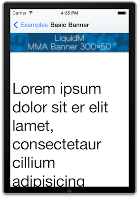

LiquidM iOS SDK
===============

TODO: Version, Adapter description

The LiquidM iOS SDK allows you to request and present ads in your app. It includes the newest mobile ad technology and provides the follwoing features:

* Request & integrate banners and interative creatives based on standard adslot sizes (mma, medium rectangle etc.)
* Request & integrate banners and interative creatives based on custom adslot sizes
* HD banner support
* Supports [MRAID 2.0](http://www.iab.net/media/file/IAB_MRAID_v2_FINAL.pdf) (interactice rich media creatives)
* Interstitials based on images
* Pre- and post-roll Video ads (based on [VAST](http://www.iab.net/media/file/VASTv3.0.pdf))
* Supports Video ads skip button
* Video player landscape-portrait auto adaptation
* DFP mediation (External adapter for [DFPNetwork Mediation](https://developers.google.com/mobile-ads-sdk/docs/dfp/mediation))

Repository structure
--------------------

This repository contains an example app (LiquidMExampleApp) and provides all the files to integrate the LiquidM iOS SDK in your app. We suggest that you clone this repository with git (git clone https://github.com/liquidm/ios-sdk-sample.git). If you're not familiar with git you can download the content of this repository as zip archive ([download](https://github.com/liquidm/ios-sdk-sample/archive/master.zip)).

After you cloned this repository or unzipped the archive you'll find the following structure:

* [adapter](https://github.com/liquidm/ios-sdk-sample/tree/master/adapter): This folder contains the adapter to integrate the LiquidM iOS SDK into the [DFP Network Mediation](https://developers.google.com/mobile-ads-sdk/docs/dfp/mediation)
* [docs](https://github.com/liquidm/ios-sdk-sample/tree/master/docs): Contains a documentation of the public SDK interface
* [example](https://github.com/liquidm/ios-sdk-sample/tree/master/example): Contains an example app which contains the LiquidM iOS SDK
* [framework](https://github.com/liquidm/ios-sdk-sample/tree/master/framework): This folder contains the actual SDK
* [CHANGELOG.md](https://github.com/liquidm/ios-sdk-sample/blob/master/CHANGELOG.md): Documentation of SDK changes
* [README.md](https://github.com/liquidm/ios-sdk-sample/blob/master/README.md): this documentation

Try the example app
-------------------

First of all you should try to open our example app which contains already the LiquidM iOS SDK. To do so you just have to open the project file "LiquidMExample.xcworkspace" in the [example folder](https://github.com/liquidm/ios-sdk-sample/tree/master/example) with XCode. This example app should work out of the box and you can try to start the app by pressing the play button. This starts the example app in the simulator and you can request e.g. a basic banner:

If you see the banner which is shown above you can start to integrate the SDK in your app. If you've issues with the example app please make sure that your XCode is uptodate. We created this documentation with XCode 5.0.2.

Integrate the SDK in your app
-----------------------------

1. Add 'LiquidMiOSSDK.framework' to your project.
2. Add the following iOS frameworks to your project: (TODO: ???)

<pre>
AudioToolbox.framework
MessageUI.framework
StoreKit.framework
SystemConfiguration.framework
AdSupport.framework
CoreMedia.framework
MediaPlayer.framework
EventKit.framework
EventKitUI.framework
AVFoundation.framework
libxml2.dylib (TODO: 3rd party library OS dependent expain build dependency) => or put it on requirements (best would be not depend on such thing)
LiquidMiOSSDK.framework   TODO: update library name
</pre>

3.1. Add the following flags to 'Other Linker Flags' in 'Build Settings':
<pre>-ObjC</pre>
Confirm that flags are set for both 'DEBUG' and 'RELEASE'.

4. Add the bundle inside the framework. This can be found on LiquidMiOSSDK.framework/Versions/A/Resources

5. Import the SDK in your code:

<pre>#import &lt;LiquidMiOSSDK/LiquidM.h&gt;</pre>

5. Declare the following properties in 'AppDelegate.h': (TODO: rename LiquidMAppDelegate to avoid confusions.. it's the Clients App not owers)

<pre>
@property (strong, nonatomic) LiquidMViewController *liquidMClient; //object for initializing the LiquidM iOS SDK
</pre>

6. Instantiate the 'LiquidMViewController' class inside the View DLE 'viewDidLoad' method of 'AppDelegate.m': (TODO: verify this)

<pre>
//Instantiate the AppDelegate
AppDelegate *appDelegate = (AppDelegate *)[[UIApplication sharedApplication] delegate];

//Specify your LiquidMiOSSDK Options ( EXAMPLE : TODO: some can have hardcoded defaults internally e.g TestTokn => but allow overrride to customize them maybe?)
NSString *token = @"YOUR-TOKEN";
NSString *appName = @"YOUR-APP-NAME";
NSString *appVersion = @"YOUR-APP-VERSION";
NSString *appRequester = @"YOUR-APP-REQUESTER";

or (TODO: what's the best.. use raw properties ot a Dictionary => I would prefer a plain text file outside app code.. to configure them= > no code changes)

NSDictionary *options = @{
    LiquidMControllerOptionTokenTag: @"YOUR-TOKEN",
    LiquidMControllerOptionReload: [NSNumber numberWithBool:NO](TODO: docs do not talk about realoading ?? What's the goal of this?)
};
...

//Instantiate LiquidMViewController to initialize your LiquidMiOSSDK
appDelegate.liquidMClient = [[LiquidMViewController alloc]
                            initWithOrganizationId:orgName
                            applicationId:appName];

</pre>

Technical Details (TODO: something like this makes it more professional)
-----------------
- The majority of the Objective-C classes make use of ARC.
- Targeted for iOS 5.0 and newer.
- Requires Xcode 5.0.2 (or newer) to build from source.

Compatibility with iOS 7
------------------------
- We have tested with iOS 7 and there are no known incompatibilities.
- We do have support for NSURLSession in our capture of network performance metrics.

Explicitly Setting Xcode Version
--------------------------------
The build script makes use of the default installation of Xcode.  If you need to configure the build to use a
different version of Xcode, please uncomment the code that assigns the path for DEVELOPER_DIR in source/Scripts/dist.sh.

SDK Functionality for LiquidM iOS Framework
------------------------------
New classes (ApigeeCollection, ApigeeEntity, ApigeeDevice, ApigeeGroup) to make working with entities and collections easier. The functionality has been modeled after our JavaScript and PHP SDKs.

Banners and Script Tags Request(s) *adClass* or *adSize*
---------------------------------

1. Banners and Script Tags Request by *adClass*
- LiquidMAdClassMMA
- LiquidMAdClassRichMedia
- .. (TODO: add here all classes options)

TODO: (Unify Examples : instantiations loooks a bit differnt from banners to videos... is that need?)

Banner / Script Tag Ad Example 1: requesting by BannerClass ??
-------------
<pre>
    lmAd = [LiquidMAdViewController controllerWithRootViewController:self
                                    adClass:LiquidMAdClassMMA
                                    options:options];
    lmAd.delegate = self;
    [self.view addSubview:lmAd.view];
    [self.view bringSubviewToFront:lmAd.view];
</pre>

2. Banners and Script Tags Request by *adSize*

Banner / Script Tag Ad Example 2: requesting by BannerDimension (*adSize*) ??  (320x53 banner)
-----------
<pre>
    lmAd = [LiquidMAdViewController controllerWithRootViewController:self
                                    adSize:CGSizeMake(320,53)
                                    options:nil];   TODO: WHY NIL???
    lmAd.delegate = self;
    [self.view addSubview:lmAd.view];
    [self.view bringSubviewToFront:lmAd.view];
</pre>

Video Request(s)
---------------------------------

1. Video *adClass* options
    - LiquidMAdClassVideoPreRoll
    - LiquidMAdClassVideoMidRoll
    - LiquidMAdClassVideoPostRoll

2. Video URL for the SDK user Video

    2.1 Video Supported Media Types (videoURL: YOUR_VIDEO_CONTENT_URL)
        - type: webm
          src: ['http://stream.flowplayer.org/bauhaus/624x260.webm'] (http://stream.flowplayer.org/bauhaus/624x260.webm)

        - type: mp4
          src: ['http://stream.flowplayer.org/bauhaus/624x260.mp4'] (http://stream.flowplayer.org/bauhaus/624x260.mp4)

        - type: ogg
          src: ['http://stream.flowplayer.org/bauhaus/624x260.ogv'] (http://stream.flowplayer.org/bauhaus/624x260.ogv)

Video Ad Example:
-----------
<pre>

 - (void)viewDidLoad
    {
        [super viewDidLoad];
        NSMutableDictionary *options = [NSMutableDictionary dictionary];
        [options setObject:@"<YOUR_TOKEN>"
                    forKey:LiquidMControllerOptionToken];
        [options setObject:[NSNumber numberWithBool:YES]
                    forKey:LiquidMControllerOptionFullscreen];

        videoController = [LiquidMVideoViewController controllerWithAdClass:LiquidMAdClassVideoPreRoll
                                                    videoURL:@"<YOUR_VIDEO_CONTENT_URL>"
                                                    options:options];

        videoController.delegate = self;
        videoController.view.frame = CGRectMake(0, 64, [[UIScreen mainScreen] bounds].size.width, 180);
        [self.view addSubview:videoController.view];

    }

    - (void)controllerDidReceiveAd:(LiquidMAdViewController *)controller
    {
        [videoController play];
    }

</pre>

Migrating from madvertiseiOSSDK to LiquidMiOSSDK
-----------------------

1 TODO: Describe behavior

Building From Source (Only on development => we only offer binary versions of the ) (TODO: emaybe add this info in the development branch)
--------------------
To build from source, issue this command from the /source directory of your repository: (TODO: make reference to build script)

<pre>
  ./Scripts/framework.sh
</pre>

TODO: Create iOS Classes with the Examples in a Examples Folder or a different project

LiquidMiOSSDK As(s) Integration Examples
===================

Banner
------

	- (void)viewDidLoad
	{
		[super viewDidLoad];

		NSDictionary *options = @{
        	LiquidMControllerOptionTokenTag: @"TAG_OF_TOKEN",
        	LiquidMControllerOptionReload: [NSNumber numberWithBool:NO]
    	};

		lmAd = [LiquidMAdViewController controllerWithRootViewController:self
                                                             adClass:LiquidMAdClassMMA
                                                            options:options];
        lmAd.delegate = self;
		[self.view addSubview:lmAd.view];
		[self.view bringSubviewToFront:lmAd.view];
	}

Aditional parameters like tokenTag or reload should be declared inside a NSDictionary.

To present the banners and interstitials in the ViewController, you should call `presentAd`

	- (void)controllerDidReceiveAd:(LiquidMAdViewController *)controller
	{
    	[lmAd presentAd];
	}

Interstitial
------------

	- (void)viewDidLoad
	{
		[super viewDidLoad];

		NSDictionary *options = @{
        	LiquidMControllerOptionTokenTag: @"TAG_OF_TOKEN",
        	LiquidMControllerOptionReload: [NSNumber numberWithBool:NO]
    	};

		lmAd = [LiquidMAdViewController controllerWithRootViewController:self
                                                             adClass:LiquidMAdClassRichMedia
                                                            options:options];
        lmAd.delegate = self;
	}

Position banner at custom location on your view
-----------------------------------------------

You can position the ad banner on your available view just by setting its frame.

	- (void)viewDidLoad
	{
		[super viewDidLoad];

		NSDictionary *options = @{
        	LiquidMControllerOptionReload: [NSNumber numberWithBool:YES]
    	};

		lmAd = [[LiquidMAdViewController alloc] initWithRootViewController:self
																	   adClass:LiquidMAdClassMMA
																	   options:options];
		CGRect frame = CGRectMake(0,
								  self.view.frame.size.height - lmAd.view.frame.size.height,
								  lmAd.view.frame.size.width,
								  lmAd.view.frame.size.height);
		lmAd.view.frame = frame;
		[self.view addSubview:lmAd.view];
		[self.view bringSubviewToFront:lmAd.view];
	}

Getting a banner using dimensions
---------------------------------

You can obtain banners by making a request with their specific dimensions.

	- (void)viewDidLoad
	{
		[super viewDidLoad];

		lmAd = [LiquidMAdViewController controllerWithRootViewController:self
                                                                  adSize:CGSizeMake(320,53)
                                                                 options:nil];
        lmAd.delegate = self;
		[self.view addSubview:lmAd.view];
		[self.view bringSubviewToFront:lmAd.view];
	}

Video Ads
---------

You can request video ads via `LiquidMVideoViewController` like in the following
example:

    - (void)viewDidLoad
    {
        [super viewDidLoad];
        NSMutableDictionary *options = [NSMutableDictionary dictionary];
        [options setObject:@"<YOUR_TOKEN>"
                    forKey:LiquidMControllerOptionToken];
        [options setObject:[NSNumber numberWithBool:YES]
                    forKey:LiquidMControllerOptionFullscreen];

           videoController = [LiquidMVideoViewController controllerWithAdClass:LiquidMAdClassVideoPreRoll
                                                                   videoURL:@"<YOUR_VIDEO_CONTENT_URL>"
                                                                    options:options];
        videoController.delegate = self;
        videoController.view.frame = CGRectMake(0,
                                                64,
                                                [[UIScreen mainScreen] bounds].size.width,
                                                180);
        [self.view addSubview:videoController.view];
    }

    - (void)controllerDidReceiveAd:(LiquidMAdViewController *)controller
    {
        [videoController play];
    }
